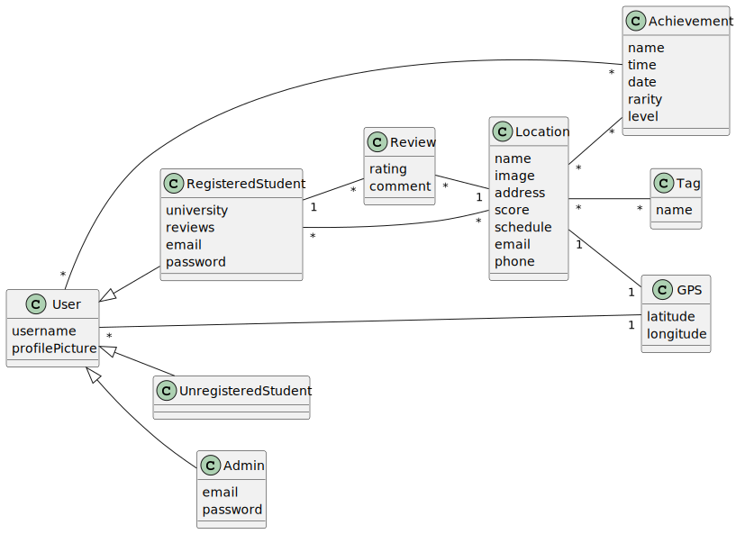

# 2LEIC18T4 - Study@ Development Report
Documentation for the Study@ App from a high-level vision to low-level implementation decisions, a kind of Software Development Report, organized by type of activities: 

* [Business Modeling](#Business-Modelling) 
  * [Product Vision](#Product-Vision)
  * [Features and Assumptions](#Features-and-Assumptions)
  * [Elevator Pitch](#Elevator-pitch)
* [Requirements](#Requirements)
  * [Domain model](#Domain-model)
* [Architecture and Design](#Architecture-And-Design)
  * [Logical architecture](#Logical-Architecture)
  * [Physical architecture](#Physical-Architecture)
  * [Vertical prototype](#Vertical-Prototype)
* [Project management](#Project-Management)

This Project was Developed for ESOF 2023/2024 by:
- Afonso Pedro Maia de Castro 	            (up202208026@up.pt)
- Clara Paulino Barros Sousa 	              (up202207582@up.pt)
- João Vicente Pereira Mendes 	            (up202208586@up.pt)
- Miguel Moita Caseira 	                    (up202207678@up.pt)
- Pedro Trindade Gonçalves Cadilhe Santos 	(up202205900@up.pt)
- Rodrigo Dias Ferreira Loureiro de Sousa 	(up202205751@up.pt)

## Business Modeling

The Goal that was proposed to us for this project was creating an app that aligns with the sustainable development goals [(SDGs)](https://www.eca.europa.eu/en/sustainable-development-goals) is a meaningful and impactful way to contribute to global challenges, in a FEUP-centric setting, that may be expanded to other faculties, possibly universities.
As such, we have arrived at a central theme:
- Finding Study Spots, which can be selected for their sustainability, energy efficiency, waste reduction and have interactive maps with user ratings and calendar events, for example.

## Product Vision
**If you are a student come and find your ideal study spot with our app, where productivity meets sustainability in every click!**

 [...]
 

### Features and Assumptions
//////////////////////////////////////////////////////////////
//////////////////////////////////////////////////////////////
//////////////////////////////////////////////////////////////
//////////////////////////////////////////////////////////////
//////////////////////////////////////////////////////////////
//////////////////////////////////////////////////////////////
//////////////////////////////////////////////////////////////
//////////////////////////////////////////////////////////////

### Elevator Pitch
//////////////////////////////////////////////////////////////
//////////////////////////////////////////////////////////////
//////////////////////////////////////////////////////////////
//////////////////////////////////////////////////////////////
//////////////////////////////////////////////////////////////
//////////////////////////////////////////////////////////////
//////////////////////////////////////////////////////////////
//////////////////////////////////////////////////////////////
## Requirements

### Domain Model

## Architecture and Design

### Logical Architecture

### Physical Architecture
### Vertical Prototype

## Project Management

### Sprint 0 Board

