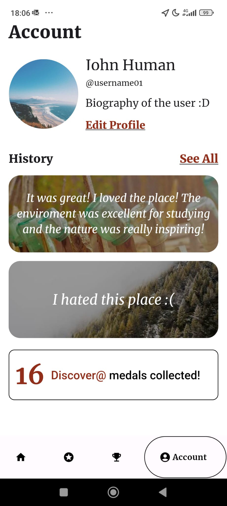

# 2LEIC18T4 - Study@ Development Report
Documentation for the Study@ App from a high-level vision to low-level implementation decisions, a kind of Software Development Report, organized by type of activities: 

- [2LEIC18T4 - Study@ Development Report](#2leic18t4---study-development-report)
  - [Business Modeling](#business-modeling)
  - [Product Vision](#product-vision)
    - [Features and Assumptions](#features-and-assumptions)
    - [Elevator Pitch](#elevator-pitch)
  - [Requirements](#requirements)
    - [Domain Model](#domain-model)
  - [Architecture and Design](#architecture-and-design)
    - [Logical Architecture](#logical-architecture)
    - [Physical Architecture](#physical-architecture)
    - [Vertical Prototype](#vertical-prototype)
  - [Project Management](#project-management)
    - [Sprint 0 Board](#sprint-0-board)

```
This Project was Developed for ESOF 2023/2024 by:
- Afonso Pedro Maia de Castro 	                        (up202208026@up.pt)
- Clara Paulino Barros Sousa  	                        (up202207582@up.pt)
- João Vicente Pereira Mendes 	                        (up202208586@up.pt)
- Miguel Moita Caseira 	                                (up202207678@up.pt)
- Pedro Trindade Gonçalves Cadilhe Santos 	        (up202205900@up.pt)
- Rodrigo Dias Ferreira Loureiro de Sousa 	        (up202205751@up.pt)
```

## Business Modeling

The Goal that was proposed to us for this project was creating an app that aligns with the sustainable development goals [(SDGs)](https://www.eca.europa.eu/en/sustainable-development-goals) is a meaningful and impactful way to contribute to global challenges, in a FEUP-centric setting, that may be expanded to other faculties, possibly universities.
As such, we have arrived at a central theme:
- Finding Study Spots, which can be selected for their sustainability, energy efficiency, waste reduction and have interactive maps with user ratings and calendar events, for example.

## Product Vision
**If you are a student come and find your ideal study spot with our app, where productivity meets sustainability in every click!**


 

### Features and Assumptions
//////////////////////////////////////////////////////////////
//////////////////////////////////////////////////////////////
//////////////////////////////////////////////////////////////
//////////////////////////////////////////////////////////////
//////////////////////////////////////////////////////////////
//////////////////////////////////////////////////////////////
//////////////////////////////////////////////////////////////
//////////////////////////////////////////////////////////////

### Elevator Pitch
//////////////////////////////////////////////////////////////
//////////////////////////////////////////////////////////////
//////////////////////////////////////////////////////////////
//////////////////////////////////////////////////////////////
//////////////////////////////////////////////////////////////
//////////////////////////////////////////////////////////////
//////////////////////////////////////////////////////////////
//////////////////////////////////////////////////////////////
## Requirements

### Domain Model


> Note: The PlantUML code for UML can be found [here](docs/UML/domain_model.plantuml)
 
> Alternate [png](out/docs/UML/domain_model/study@.png)


In our app structure we have a User class, that contains in its atributes the main information related to all types of users: username and profile picture.

This later serves as the parent class to the Admin, Unregistered Student, and the Registered Student Classes, where this last one contains the rest of the information of the non-admin users that have created a account (password, email, university and reviews).
Related to the Registered Student, we have the Review class (with all the details of a review: rating and the comment), and related to the User, we have a GPS class with the latitude and longitude of the user's location.

Connected to the Review, the GPS and to the Registered Student (for the user's favourite locations), we then have an Location class where all the caracteristics of the various locations of the app are stored (name, image, adress, score, schedule, email, phone).

For last but not least, we have a Tag class (with a name atribute) connected to the Location, and an Achievement class with all its related info (name, time, date, rarity and level), linked to the user and also to the location.


 
## Architecture and Design

### Logical Architecture


> Note: The PlantUML code for UML can be found [here](docs/UML/logical_architecture.plantuml)
 
> Alternate [png](out/docs/UML/logical_architecture/study@.png)

### Physical Architecture


### UI Mockups
#### Starting Page


#### Login Page


#### Home Page


#### Location Page


#### Location Reviews Page


#### Search Filters Page


#### Starred Page


#### Achievements Page


#### Profile Page


### Vertical Prototype
#### Sprint 0


#### Sprint 1




## Project Management
In order to facilitate team communication and organization, [GitHub Projects](https://github.com/orgs/FEUP-LEIC-ES-2023-24/projects/74) was used to do the Project Management of this project.

The project has 6 columns: **User Stories**, **Product Backlog**, **Sprint Backlog**, **In progress**, **In Review** and **Done**. It is important to note that, at the end of any iteration, the tasks that weren't finished are passed to the next one, so that the In Progress column appears empty at the end of every iteration.
### Sprint 0 Board


### Sprint 1 Board


For this Sprint, We organized all user stories that we have made in the **User Stories** Column and began sorting from there to the **Product Backlog**. We then moved the ones that we thought were essential to start off with to the **Sprint Backlog** to work with them. In the Sprint Backlog we also added the points that we had to deliver until the end of this sprint, such as UMLs and Prototypes.
All User Stories can be found [here](https://github.com/FEUP-LEIC-ES-2023-24/2LEIC18T4/labels/user-story), highlighted with the tag `user-story`
